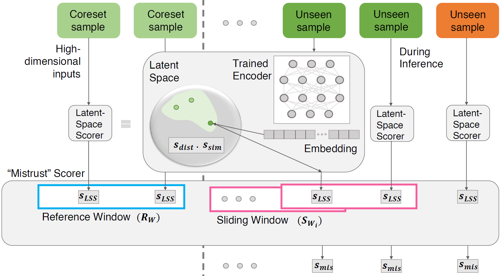

# TrustLapse

This repository contains the code for the paper: <br>
[TrustLapse: An Explainable and Actionable Mistrust Scoring Framework for Model Monitoring](https://arxiv.org/abs/2207.11290)

- Authors: Nandita Bhaskhar, Daniel Rubin, Christopher Lee-Messer
- Published at: IEEE Transactions on Artificial Intelligence (IEEE-TAI)

<p align="center">
     <br>
</p>


## Intro to TrustLapse
Continuous monitoring of trained ML models to determine when their predictions should and should not be trusted is essential for their safe deployment. Such a framework ought to be high-performing, explainable, post-hoc and actionable. We propose TRUST-LAPSE, a “mistrust” scoring framework for continuous model monitoring. We assess the trustworthiness of each input sample’s model prediction using a sequence of latent-space embeddings. Specifically, (a) our latent-space mistrust score estimates mistrust using distance metrics (Mahalanobis distance) and similarity metrics (cosine similarity) in the latent-space and (b) our sequential mistrust score determines deviations in correlations over the sequence of past input representations in a non-parametric, sliding-window based algorithm for actionable continuous monitoring. 

We evaluate TRUST-LAPSE via two downstream tasks: (1) distributionally shifted input detection, and (2) data drift detection. We evaluate across diverse domains– audio and vision using public datasets and further benchmark our approach on challenging, real-world electroencephalograms (EEG) datasets for seizure detection. Our latent-space mistrust scores achieve state-of-the-art results with AUROCs of 84.1 (vision), 73.9 (audio), and 77.1 (clinical EEGs), outperforming baselines by over 10 points. We expose critical failures in popular baselines that remain insensitive to input semantic content, rendering them unfit for real-world model monitoring. We show that our sequential mistrust scores achieve high drift detection rates; over 90% of the streams show < 20% error for all domains. Through extensive qualitative and quantitative evaluations, we show that our mistrust scores are more robust and provide explainability for easy adoption into practice.


## Updates
- __[04/29/2023]__ The code is currently being cleaned up for release. Please stay tuned for updates. If you'd like to access our code sooner, reach out to us via [email](#contact)

## Contact Us
<a name="contact"></a> 
This repository is being developed at Stanford's Rubin Lab and Lee-Messer Lab. Please reach out to `nanbhas [at] stanford [dot] edu` if you would like to use or contribute to `TrustLapse`. 


## Citation
```bib
@article{bhaskhar2023_trustlapse,
  title={TRUST-LAPSE: An Explainable & Actionable Mistrust Scoring Framework for Model Monitoring}, 
  author={Nandita Bhaskhar and Daniel L. Rubin and Christopher Lee-Messer},
  journal={IEEE Transactions on Artificial Intelligence (IEEE-TAI)},
  year={2023}
}
